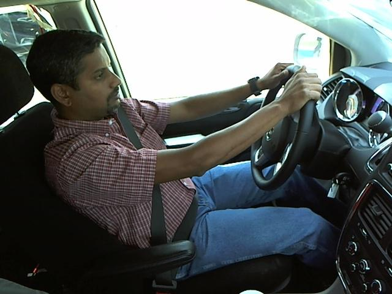
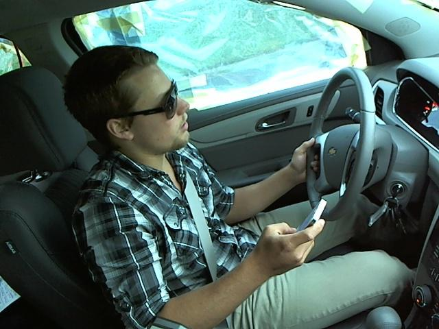
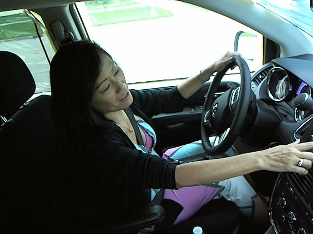
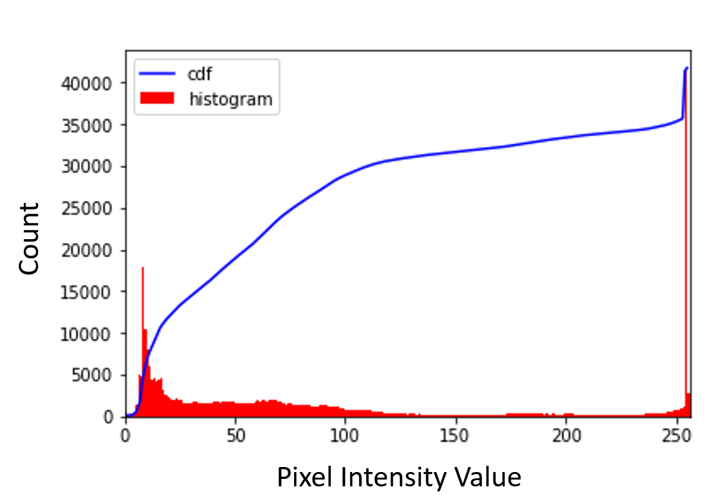
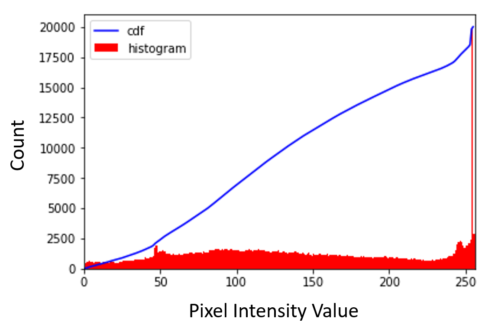
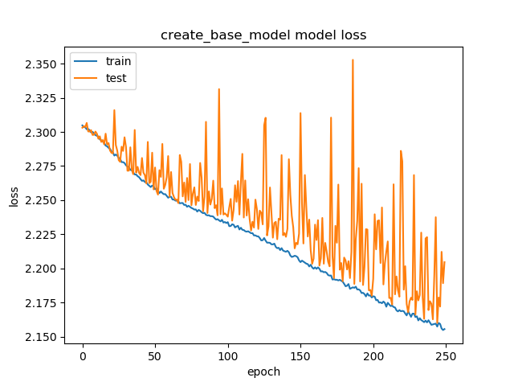
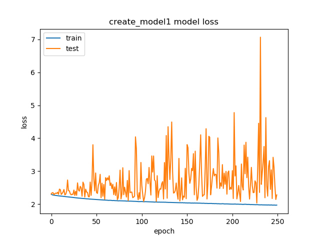
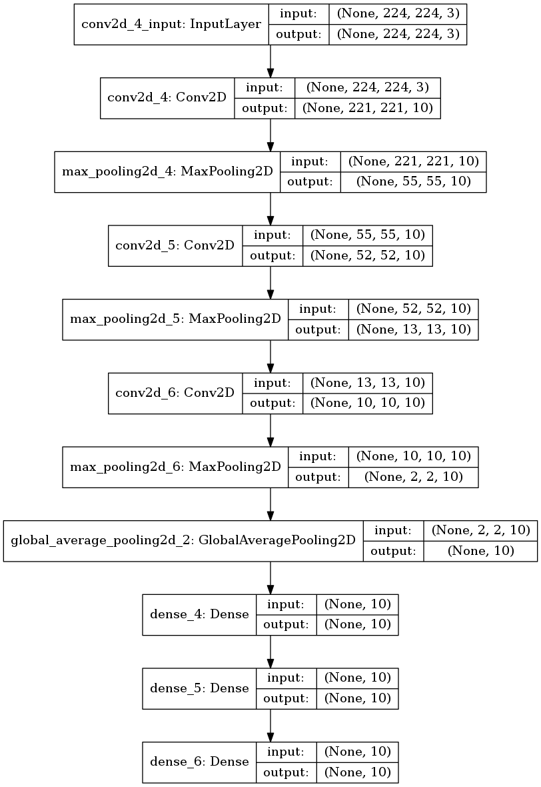
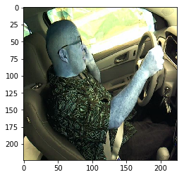

# Machine Learning Engineer Nanodegree
## Capstone Project
Pushkar Varma
April 1, 2018

## I. Definition
### Project Overview
The general idea for this project was taken from a Kaggle competition initiated by State Farm.  Car accidents are caused by many reasons, but according to the CDC, about 20% of those accidents are due to distracted drivers.  This translates to 391,000 people injured and 3,477 people killed by distracted driving, based on 2015 data by the CDC, and 2015 has had the largest number of distracted driving deaths since 2010.  The number of deaths due to distracted driving can be reduced through both social and technical means.  This project discusses how technical means can be used to detect distracted driving.  If distracted driving can be detected effectively, drivers can be alerted quickly before accidents occur.  Additionally, opportunities may arise in helping detect other kinds of impaired driving scenarios such as drunk driving, which is also a major cause of deaths on the road.  

Based on data from NHTSA, 16-24 years old have the highest cell phone use. There are various types of distractions: cognitive, visual and manual.  The manual distractions are easier to detect due to physical spatial movements that deviate from the nominal posture for driving.  " Teens were the largest age group reported as distracted at the time of fatal crashes." [3]  Based on electronic device use in the US, there has been an increasing trend in "visible manipulation of handheld devices" from 2006 to 2015. [4]

Detecting various distracted behaviors can help improve driver behavior and prevent deaths.  Additional opportunities can arise in helping insurance companies optimize their insurance policies for customers willing to integrate such technical mechanisms and share their driving behavior with insurance companies.

##### Datasets and Inputs

The input dataset will be taken from the Kaggle competition for distracted driving, as provided in reference [6].  The dataset contains 22424 training images and 79726 testing images, created by StateFarm with various distracted driver positions.  The training images are already stored in folders representing a specific class.  Each image size is 640x480 and is a color JPG file.  There are a total of 10 classes for which training images are provided and a large set of unlabeled test images is also provided.

The 10 classes are as follows with the number of training images provided for each class.  A sample image of each class is provided in the *Data Exploration* below.

```
  c0: safe driving  (2489 images)
  c1: texting - right  (2267 images)
  c2: talking on the phone - right (2317 images)
  c3: texting - left (2346 images)
  c4: talking on the phone - left (2326 images)
  c5: operating the radio (2312 images)
  c6: drinking (2325 images)
  c7: reaching behind (2002 images)
  c8: hair and makeup (1911 images)
  c9: talking to passenger (2129 images)
```

***Figure 1- Image Classifications***

### Problem Statement
The problem is to detect distracted driving behavior postures in camera images and classify driver behavior as being in one of a pre-defined set of behavior classes, such as normal driving, texting, and drinking, for a total of 10 different classes, as described in the previous section.

The camera images will be loaded and processed using deep learning, in particular Convolutional Neural Networks (CNN), and classification accuracy will be measured to gauge effectiveness of the model.  Based on the effectiveness of the model, as a possible application, the model can be deployed in camera mounted devices within cars to warn users when distracted driving behavior is detected

The classification will be performed using CNNs, with regularization techniques such as Dropout or L1 regularization to prevent overfitting, using various hyperparameter values to determine which decay values work best.  The original set of images will be divided into a training set, validation set and testing set to prevent bias and effectively measure model performance.  

A baseline model will be used to assess the performance of a basic model for distraction classification, and then several other model designs will be used to improve on classification accuracy and compare that with the baseline model. Training is done on both raw images and grayscaled/histogram equalized images to determine which results in better model performance.

The final trained model will be used to classify any given input image from the test set or the unlabeled image set in order to determine whether an image contains any class of distraction, `c0` to `c9`.

### Metrics
The `accuracy` metric will be used to measure how well the model was trained by evaluating the model with a test image set.  This `accuracy` metric is most appropriate since images are being classified into one of 10 classes, and a performance binary decision is made as to whether the classification is correct or not based on the predicted class vs. actual class.   For example, for a set of 100 images, if 90 of the images are classified with a predicted class equal to actual class, then the classification accuracy will be considered to be 90%.  

## II. Analysis
### Data Exploration
There are 2 datasets provided - one is a set of labeled training images, and another set is a set of unlabeled images.  The datasets contains full color images with a size of 640x480 pixels.  

Overall the labeled dataset seems balanced, other than the `c7 & c8` classes that seem to have the least number of images.  This may lead to bit more bias towards class `c0` having the most number of samples, hence classification accuracy for `c0` may be higher, and similarly for some of the other classes such as `c2-c6`.  The diagram shows a visual of the distribution of the count by class.

In order to alleviate in imbalances, the training dataset will be trimmed to ensure ***equal number of images*** exist for all classes.


***Figure 2 - Distribution of Images by Class***

This dataset is being used since it is a public dataset provided by StateFarm and is a large set specifically created for covering a large class of distractions that most commonly occur.  As part of the submission of this Capstone project, a small subset will be provided as samples.

The following tables shows samples of an image in each class, `c0` to `c9` , and the larger sample of images has been provided in the `sample_images` folder.

|   c0   |   c1   |  c2  |    c3    |   c4   |
| :----------------------------------------: | :--------------------------------------: | :----------------------------------------: | :----------------------------------------: | :----------------------------------------: |
| **c5** | **c6** | **c7** | **c8** | **c9** |

***Figure 3 - Sample images from each class***

### Exploratory Visualization
The image set provided contains colored images of various driver postures that are in 10 different classes.  An initial look at the grayscale image and its histogram shows there are many pixels with low intensity below 120, and a smaller number of pixels with high intensity above 230.  A sample and its histogram is shown below.   The sample image's histogram is equalized and both the processed image and its new histogram is shown as well.  

|                            Image                             |                      Processing Results                      |
| :----------------------------------------------------------: | :----------------------------------------------------------: |
| **Original Image** |  |
| **Image - Histogram Equalized** |  |
| **Original Image** | **Morphological Dilation** |

***Figure 5 - Image Transformations***

The output will be chosen based on maximum likelihood of a class and compared with target label, and the classification accuracy percentage will be calculated.

The original premise is to prevent any bias towards a specific image region with lower or higher intensities, so one method used was to grayscale all images and equalize their histograms.   This technique was used to assess the performance of the best model design based on assessment of multiple models trained with the original colored images.

Additionally, OpenCV's morphological operations were used to determine whether there were additional features that could be detected [9].  The above table, in the 3rd row, shows a grayscaled image on the left and a morphological dilated image on the right.  This particular dilation is able to show object edges with significant contrast, such as in the person's forearm, but it becomes difficult to detect edges in uniform colored areas such as the person's upper arm with a black shirt.  So this dilation technique to detect edge features did not seem to be an effective technique and was not used.  

### Algorithms and Techniques

The solution will consist of a machine learning pipeline with pre-processing, training, testing, and accuracy measurement stages.  The solution will use Convolutional Neural Networks (CNNs) since the input data is a set of images, i.e. 2-D tensors, and  CNNs have been proven to be very effective for image classification, and in particular for posture classification [5,9].  

In the pre-processing stage, the images will be pre-processed to 224x224x3 , with the same aspect ratio, in order to reduce processing time.  The images will be rescaled, and both raw color images and gray scaled images will be used for model training and prediction.  

Additionally, the CNN will use some of the following techniques:

- Local and/or Global Pooling to allow for position invariance, 
- *softmax* activation function for classifying based on likelihood since the output will  be based on a set of mutually exclusive classes, 
- *ReLU* activation function for increasing the non-linear capacity of the network,
- Regularization methods such as *Dropout*  or *L1 Regularization* to gain processing efficiency and reduce overfitting.

The output will be chosen based on maximum likelihood of a class and compared with target label, and the classification accuracy percentage will be calculated.

In general, multiple model designs will be explored, and models will be trained until overfitting is observed and then various regularization methods will be used to compensate for reduce the bias/variance tradeoff and minimize overfitting.

### Benchmark

There are a couple of benchmarks that are used to compare the performance of the learning model.  The first benchmark that is used is a CNN with a single 2D Convolution layer, a single 2D max local pooling layer, flattening layer and a single dense layer.   This will set a baseline for how a simple model performs.  

A secondary benchmark model that is referenced are the results obtained in the whitepaper, [5], on the same Statefarm dataset used in this project.  The whitepaper uses the same Statefarm dataset and performs training with genetically weighted ensemble of CNNs to obtain a classification accuracy of 95.98%. 

The design of the baseline CNN model is shown in *Figure 6*.    This model consists of the following layer configurations:

- 2D convolution layer with a default *stride*=(1,1), *kernel size* = (4,4), and *input shape* = (224,224,3).
- Local Max 2D Pooling layer with a *pool size* = (4,4) and a *stride* = (4,4)
- Flatten layer
- Dense layer with an input of 302510x1 and output of 10x1 with a *softmax* activation function.

```
_________________________________________________________________
Layer (type)                 Output Shape              Param #
=================================================================
conv2d_1 (Conv2D)            (None, 221, 221, 10)      490
_________________________________________________________________
max_pooling2d_1 (MaxPooling2 (None, 55, 55, 10)        0
_________________________________________________________________
flatten_1 (Flatten)          (None, 30250)             0
_________________________________________________________________
dense_1 (Dense)              (None, 10)                302510
=================================================================
Total params: 303,000
Trainable params: 303,000
Non-trainable params: 0
_________________________________________________________________
```

***Figure 6 - Baseline CNN***

Classification accuracy will be used as a primary metric to evaluate the performance of the trained model.   The accuracy will be simply based on the ratio of the number of images classified accurately to the total number of images.  Each image will be classified accurately if the class identified by the model is the same as the label for the image.  This percentage will be used to compare to the benchmark described above.  Since the training dataset will be defined to be balanced, there is no expected skewness, hence no additional adjustments necessary for evaluating performance.

#### Analysis of the Baseline Model

The baseline CNN model used the `softmax` activation function in the last dense layer and was trained over 250 and 500 epochs to determine how accuracy would change and whether it would converge towards to certain value.  

| Training vs. Testing Accuracy                                | Training vs. Testing Loss                                    | Training Accuracy | Validation Accuracy | Evaluation Accuracy |
| ------------------------------------------------------------ | ------------------------------------------------------------ | ----------------- | ------------------- | ------------------- |
|  |  | 20.23%            | 16.82%              | 16.16%              |
|  |  | 23.85%            | 24.84%              | 24.08%              |

***Figure 7.1 - Baseline Model Training results***

The base model training accuracy seems to increase very slowly even though the number of epochs used is doubled, and the validation accuracy has high variance, but the validation loss and accuracy curves seem to follow the training curves.  The validation accuracy and loss curves both have high variance hence showing sensitivity to unseen data, possibly due to the simplicity of the model design and underfitting.  

## III. Methodology

### Data Preprocessing
The original dataset is composed of the labeled dataset with images for each class and an unlabeled dataset.   The labeled dataset is split into a training, validation and testing sets.   The unlabeled set is manually sampled to provide evaluations of the final trained model that resulted in the highest evaluation accuracy with the testing dataset.

As shown earlier, the number of images for each class was not equal, so for this project, an equal number of images were selected for all classes in order to remove any bias during training towards a specific set of classes.   A total of 1900 images were selected for each class, .e.g `c0` to `c9`.   A total of 19,000 images were used, with 15,200 images for the training/validation sets and 3800 images for the testing set.  The validation split of 25% was used in the *keras* models, so 11,400 images were used for training and 3800 images were used for validation. 

The images used were resized into 224x224 pixels, and converted into 4D tensors of size 224x224x3 for use with tensorflow.  The `paths_to_tensor()` in `capstone-model-engine.py` implements this conversion.

Furthermore, grayscale transformation and histogram equalization was performed as discussed above in the *Exploratory Visualization* section.  After assessing many model designs, the best model design was selected and trained on the grayscale images as well to assess the performance of the model and this is discussed further below.

For the target labels, *onehot* encoding was done for both training, validation and testing label targets since the target labels are categorical values from 0 to 9.

### Implementation
#### *Environment*

The model design, training and evaluation were done using the *Keras* API with a *Tensorflow* backend, with a NVIDIA GPU GeForce 940MX on a personal laptop as well as a NVIDIA Telsa K80 on a AWS Deep Learning EC2 instance (p2.xlarge).  The initial setup on the laptop involved installing the NVIDIA CUDA and cuDNN drivers with appropriate versions, which was initially time consuming and challenging, but once setup, many models were trained on the laptop and the AWS EC2 instance.  The key difference between the 2 hardware configurations were the GPU memory used, which impacted the model training time.  The laptop GeForce GPU only had 2GB, and the AWS Tesla GPU had 12GB, this resulted in faster model training time on the Tesla GPU, as observed on a per epoch basis.    However, due to cost, the Tesla GPU was used over a limited time period, and the exact difference in model training time between the 2 environments was not measured since it was out of scope for this project.

The initial implementation was written in a *Jupyter* notebook and then exported into  a separate python file so the model training could be run in the background.

#### *Loading / Pre-processing Data*

The initial image data was loaded using the *Keras* `preprocessing.image` class, with the images resized to 224x224, and converted into 4D tensors for use in model training.  This was generally not difficult and was adopted from the course *dog identification project*, since both projects involved image classification.

The function used in the `capstone-model-engine.py` program to load and pre-process the images is show below:

```python
def path_to_tensor(img_path, equalized=False):
    # loads RGB image as PIL.Image.Image type
    img = image.load_img(img_path, target_size=(224, 224), grayscale=equalized)
    if (equalized == True):
        img = np.array(img)
        #equalize histogram
        img = equalize_histogram(img_array, 16)
    # convert PIL.Image.Image type to 3D tensor with shape (224, 224, 3)
    x = image.img_to_array(img)
    # convert 3D tensor to 4D tensor with shape (1, 224, 224, 3) and return 4D tensor
    return np.expand_dims(x, axis=0)
```

***Figure 8 - Image pre-processing***

Most of the model training was done using the color images, but some model training involved the histogram equalized images.  Histogram equalization is either done on a single channel, i.e. grayscale, or statistic of multiple channels, i.e. color, using the YCbCr color scheme.   I had decided to use grayscale since that was the easiest way to perform histogram equalization, and also determine how model training would perform on grayscale images.  A key issue with equalizing color images are that many implementations normally equalize by each channel and then combine the channels into a single image, which results in inappropriate transformations to colors of an image.

#### *Model Design*

Beyond the baseline model, a key challenge is in designing a more complex model architecture with the appropriate hyperparameters, identifying the appropriate hyperparameter values, and determining the number and type of layers in a CNN.  


***Figure 9 - Model Design Considerations***

Many model designs were explored and tested.  The saved models are available in the `saved_models` folder, the model design images are available in the `model_pics` folder, and log files are available in the `logs` folder.   A total of 26 model architectures were explored, with some models with varying hyperparameter values, so in essence, over 39 model iterations were explored.  

Some of the initial model designs were that trained and tested were not very good.  The initial focus was to simply extend the baseline model with various changes in order to observe the impact on model training.  

After running many model iterations, several patterns were identified in model design:

- *Batch Normalization* between 2D convolution and 2D max pooling introduces significant noise to cause high variation in accuracy and loss, i.e. see Model 1 below.
- *DropOut* layer after each *Dense* layer (more than once) seems to cause enough information loss that accuracy and loss have high variation and neither converges even after large number of epochs, e.g. see Model 8 below.  However, putting *DropOut* layers also after each Conv-2D/Max-Pooling layers causes increase and convergence towards a high accuracy, around 55%, but high variance in the validation accuracy.
- Based on the image size, and kernel size in the Conv-2D layers, there was a  maximum of **3** Conv-2D layers that could be supported. 
- Larger number of *Dense* layers seems to cause high variation in the validation accuracy/loss curves and slower convergence.  

| Baseline Model                                               | Model 1                                                      | Model 2                                                      |
| ------------------------------------------------------------ | ------------------------------------------------------------ | ------------------------------------------------------------ |
|                        |                                |                                |
|  |  |  |

***Figure 10 - Experimental models***

#### *Model Evaluation*

The models were first evaluated using the algorithm below, adopted from an earlier course project.  However, this accuracy consistently tended to be significantly below the validation accuracy.

```python
def predict_distraction(model):
    # get index of predicted distraction for each image in test set
    distraction_predictions = [np.argmax(model.predict(np.expand_dims(tensor, axis=0))) for tensor in test_tensors]

    # report test accuracy
    test_accuracy = 100*np.sum(np.array(distraction_predictions)==np.argmax(test_targets, axis=0))/len(distraction_predictions)
    return test_accuracy
```

***Figure 11 - Older algorithm used for evaluation***

The following evaluation algorithm started being used later and resulted in an accuracy closed to the validation accuracies that were being generated.

```python
def predict_distraction(model):
    print("Evaluating...")
    scores = model.evaluate(test_tensors, test_targets_onehot, verbose=0)
    print("Evaluation %s: %.2f%%" % (model.metrics_names[1], scores[1] * 100))
    return
```

***Figure 12 - Newer algorithm used for evaluation***

Some of the saved models were re-evaluated with the new evaluation algorithm, and as a result, the best models to go forward with were selected as final models - in particular Model 23 seemed to generated the highest training and validation accuracy.

### Refinement
Based on the large number of model design iterations done, as discussed above, some of the best performing models were selected and multiple hyperparameter values were used to further refine model performance.

The figure below shows several models were trained with different hyperparameter values, and which models had the best testing accuracies.  It shows that Model 23 using a Dropout layer with a Dropout value of 0.10 had the highest test accuracy, using the *Keras* model evaluation algorithm.


***Figure 13 - Model Accuracy vs. Regularization Hyperparameter Values***

#### **Initial Solution**

An initial solution considered here is one of the original models that was trained - ***model 16***.   This model consists of 3 pairs of 2D Convolution / Max Pooling layers, one 2D Global Averaging layer, and 3 Dense layers with the *<u>last</u>* layer using the L1 Regularizer with a penalty of .01.  This model design is show below with the training/validation accuracy and loss curves.

The training accuracy for this model reached 97.52%, a very high accuracy rate, with an initial accuracy rate above 90% reaching within 140 epochs.  The validation accuracy reached above 80% at relatively the same time, but converging at around 87% after 1000 epochs.   The training loss reduced significantly to 0.4025 after 1000 epochs, but the validation loss starting increasing after about 200 epochs, with a minimal loss around 0.90.  The loss curves show that this model is overfitting, and additional tuning of its regularization parameters to further reduce loss, and increase testing accuracy.

|             Model 16             |                        Accuracy Graph                        |                          Loss Graph                          |
| :------------------------------: | :----------------------------------------------------------: | :----------------------------------------------------------: |
|  |  |  |
|      **Training Accuracy**       |                   **Validation Accuracy**                    |                     **Testing Accuracy**                     |
|              97.52%              |                            86.32                             |                            92.39%                            |

***Figure 14 - Initial Solution***

Similar to *model 16*, another high accuracy rate was achieved by model 15, structurally similar, but its L1 regularization is at the <u>*first*</u> Dense layer with a penalty of 0.50.  Model 15 reached a validation loss slight lower than *model 16*, but loss increased more rapidly thereafter, but reached a relatively same loss value after 1000 epochs.  The testing accuracy for model 15 was 92.18%.

#### ***Final Solution***

In the initial solution, in both models discussed above, the model overfits.  After trial and experiment with .various model configurations, *model 23* was able to maintain high accuracy rates with reduced overfitting.

This final model solution consists of the same 3 pairs of 2D Conv./Max pooling layers, but with a Flatten layer, and 2 Dense layers separated with a single Dropout layer, and no L1 regularization.  The first Dense layer has a `relu` activation function, and the second Dense layer has a `softmax` activation function.

This model was trained with dropout values of  *[.05, .10, .15, .20, .25, .30, .35, .40]*, and the maximum testing accuracy was achieved with a dropout value of ***0.10***.  The model structure, accuracy curves and values are shown in the table below.

|             Model 23             |                        Accuracy Graph                        |                          Loss Graph                          |
| :------------------------------: | :----------------------------------------------------------: | :----------------------------------------------------------: |
|  |  |  |
|      **Training Accuracy**       |                   **Validation Accuracy**                    |                     **Testing Accuracy**                     |
|              95.82%              |                            93.55%                            |                            93.29%                            |

***Figure 15 - Final Solution***

## **IV. Results**

### Model Evaluation and Validation
In this section, the final model and any supporting qualities should be evaluated in detail. It should be clear how the final model was derived and why this model was chosen. In addition, some type of analysis should be used to validate the robustness of this model and its solution, such as manipulating the input data or environment to see how the model’s solution is affected (this is called sensitivity analysis). Questions to ask yourself when writing this section:
- _Is the final model reasonable and aligning with solution expectations? Are the final parameters of the model appropriate?_
- _Has the final model been tested with various inputs to evaluate whether the model generalizes well to unseen data?_
- _Is the model robust enough for the problem? Do small perturbations (changes) in training data or the input space greatly affect the results?_
- _Can results found from the model be trusted?_


#### ***Model Expectations***

The final model seems reasonable since it was expected there would be several Conv-2D layers needed with pooling layers to provide position invariance.  The number of Dense layers was also researched to determine what would be the right number that would not be too simple, e.g. the baseline model, and  or too complex.  Too many Dense layers with Dropout tended to cause overfitting in some cases, and in fact, 5 dense layers without Dropouts caused linear accuracy / loss curves, which was not expected.  The use of Dropouts or L1 Regularization, but not both at the same time based on models researched, reduced overfitting. 

The use of grayscaled images with histogram equalization vs. color images had slight differences in model training.  When looking at the final model, the validation loss when trained with color images was smaller than the validation loss when trained with grayscale/histogram equalized images, and respectively, the training/validation accuracy was higher as well.   This leads to the question as to whether colored images may provide information about the features in each image, or whether the colors may lead to further confusion across classifications.

#### *Model Testing / Robustness* 

In order to determine the robustness of the final model, unseen images were predicted by the model and manual validation was performed to verify whether classification is being done as expected and any variations from the nominal training data has an impact on classification.

|                                                              |                                                              |                                                              |                                                              |                                                              |                                                              |
| :----------------------------------------------------------: | :----------------------------------------------------------: | ------------------------------------------------------------ | ------------------------------------------------------------ | ------------------------------------------------------------ | ------------------------------------------------------------ |
| Hair / Makeup | Hair / Makeup | Operating Radio | Operating Radio | Operating Radio | Phone - Right |
| Phone - Left | Phone - Left | Phone - Left | Phone - Right | Phone - Right  | Reaching Behind |
| Reaching Behind | Reaching Behind | Reaching Behind  | Safe Driving | Safe Driving | Safe Driving |
| Drinking | Drinking | Talking to Passenger | Talking to Passenger | Texting - Left | Texting - Left |

The above images were also tested with final model version trained with grayscale images with the same Dropout value, and the classifications were similar.  

Both models seemed to have the following confusion in classification; similar issues were reported in [5]:

- Whenever a right hand was up, whether with or without a cell phone or a cup, it was confused as drinking.
- Talking on the phone - left or right- were confused with each other
- Texting on the phone - left or right - were confused with each other or with talking on the phone
- Any hand near the face was confused as hair/makeup. 


### Justification

In this section, your model’s final solution and its results should be compared to the benchmark you established earlier in the project using some type of statistical analysis. You should also justify whether these results and the solution are significant enough to have solved the problem posed in the project. Questions to ask yourself when writing this section:
- _Are the final results found stronger than the benchmark result reported earlier?_
- _Have you thoroughly analyzed and discussed the final solution?_
- _Is the final solution significant enough to have solved the problem?_


## V. Conclusion
_(approx. 1-2 pages)_

### Free-Form Visualization
In this section, you will need to provide some form of visualization that emphasizes an important quality about the project. It is much more free-form, but should reasonably support a significant result or characteristic about the problem that you want to discuss. Questions to ask yourself when writing this section:
- _Have you visualized a relevant or important quality about the problem, dataset, input data, or results?_
- _Is the visualization thoroughly analyzed and discussed?_
- _If a plot is provided, are the axes, title, and datum clearly defined?_

### Reflection
In this section, you will summarize the entire end-to-end problem solution and discuss one or two particular aspects of the project you found interesting or difficult. You are expected to reflect on the project as a whole to show that you have a firm understanding of the entire process employed in your work. Questions to ask yourself when writing this section:
- _Have you thoroughly summarized the entire process you used for this project?_
- _Were there any interesting aspects of the project?_
- _Were there any difficult aspects of the project?_
- _Does the final model and solution fit your expectations for the problem, and should it be used in a general setting to solve these types of problems?_

### Improvement
In this section, you will need to provide discussion as to how one aspect of the implementation you designed could be improved. As an example, consider ways your implementation can be made more general, and what would need to be modified. You do not need to make this improvement, but the potential solutions resulting from these changes are considered and compared/contrasted to your current solution. Questions to ask yourself when writing this section:
- _Are there further improvements that could be made on the algorithms or techniques you used in this project?_
- _Were there algorithms or techniques you researched that you did not know how to implement, but would consider using if you knew how?_
- _If you used your final solution as the new benchmark, do you think an even better solution exists?_

-----------

**Before submitting, ask yourself. . .**

- Does the project report you’ve written follow a well-organized structure similar to that of the project template?
- Is each section (particularly **Analysis** and **Methodology**) written in a clear, concise and specific fashion? Are there any ambiguous terms or phrases that need clarification?
- Would the intended audience of your project be able to understand your analysis, methods, and results?
- Have you properly proof-read your project report to assure there are minimal grammatical and spelling mistakes?
- Are all the resources used for this project correctly cited and referenced?
- Is the code that implements your solution easily readable and properly commented?
- Does the code execute without error and produce results similar to those reported?


### References

**Reference**

[1] https://www.kaggle.com/c/state-farm-distracted-driver-detection

[2] https://www.cdc.gov/motorvehiclesafety/distracted_driving/index.html

[3] https://www.nhtsa.gov/risky-driving/distracted-driving

[4] https://www.nhtsa.gov/sites/nhtsa.dot.gov/files/documents/driver_electronic_device_use_in_2015_0.pdf

[5] *Realtime Distracted Driver Posture Classification*, https://arxiv.org/pdf/1706.09498.pdf

[6] https://www.kaggle.com/c/state-farm-distracted-driver-detection/download/imgs.zip

[7] *Benchmark of Deep Learning Models on Large Healthcare MIMIC Datasets*, https://arxiv.org/pdf/1710.08531.pdf

[8] *Metrics To Evaluate Machine Learning Algorithms in Python*, https://machinelearningmastery.com/metrics-evaluate-machine-learning-algorithms-python/

[9] *Application of Convolutional Neural Network to Classify Sitting and Standing Postures*, http://www.iaeng.org/publication/WCECS2017/WCECS2017_pp140-144.pdf

[10] *Flexible, High Performance Convolutional Neural Networks for Image Classification*, http://people.idsia.ch/~juergen/ijcai2011.pdf

[11] *Rohan #4: The vanishing gradient problem,* https://ayearofai.com/rohan-4-the-vanishing-gradient-problem-ec68f76ffb9b

[12] *A systematic analysis of performance measures for classification tasks*, http://rali.iro.umontreal.ca/rali/sites/default/files/publis/SokolovaLapalme-JIPM09.pdf

[13] http://text-analytics101.rxnlp.com/2014/10/computing-precision-and-recall-for.html

[14] *The Effect of Batch Normalization on Deep Convolutional Neural Networks*, https://kth.diva-portal.org/smash/get/diva2:955562/FULLTEXT01.pdf

